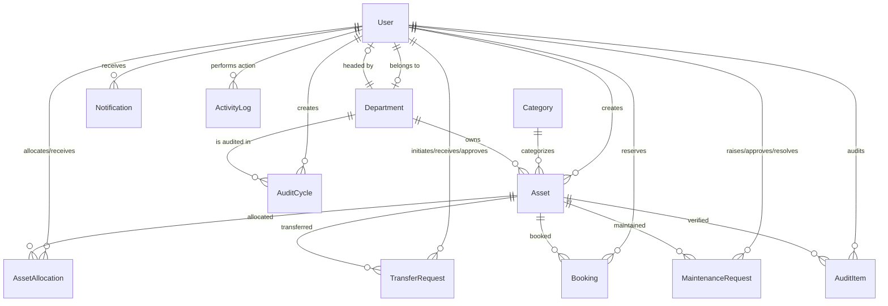

# AssetFlow ERP — Project Description & Documentation

AssetFlow is a modern, enterprise-grade Asset & Resource Management System (ERP) designed to streamline the lifecycle tracking, allocation, maintenance, and auditing of physical and digital assets within an organization. 

---

## Table of Contents
1. [Project Overview](#project-overview)
2. [Technology Stack](#technology-stack)
3. [System Architecture](#system-architecture)
4. [Database Schema & Models](#database-schema--models)
5. [Key Feature Modules](#key-feature-modules)
6. [Folder Structure](#folder-structure)
7. [Environment Configuration](#environment-configuration)
8. [Setup & Installation](#setup--installation)
9. [Running the Application](#running-the-application)

---

## Project Overview

AssetFlow ERP enables businesses to optimize asset utilization, reduce equipment downtime, verify inventory through structured audits, and maintain accountability across departments.

### Primary User Roles
*   **ADMIN**: Full system control, including workspace configurations, role promotions, and global logs access.
*   **ASSET_MANAGER**: Registers assets, manages allocations, creates audit cycles, and oversees maintenance workflows.
*   **DEPARTMENT_HEAD**: Oversees department-specific assets, requests, transfers, and reviews team allocations.
*   **EMPLOYEE**: Default role on registration. Allows requesting asset bookings, reporting maintenance issues, and verifying allocated items.

---

## Technology Stack

### Frontend
*   **Core**: React 19 (TypeScript), Vite
*   **Styling**: Tailwind CSS
*   **Routing**: React Router v6
*   **Form Management**: React Hook Form + Zod (Validation)
*   **Charts & Visualization**: Recharts
*   **Icons**: Lucide React
*   **HTTP Client**: Axios

### Backend
*   **Runtime & Framework**: Node.js, Express.js (TypeScript)
*   **ORM**: Prisma ORM
*   **Database**: MySQL 8
*   **Authentication**: JWT + Bcryptjs for secure password hashing
*   **File Uploads**: Multer
*   **QR Code Generator**: `qrcode`

---

## System Architecture

AssetFlow operates as a decoupled Monorepo containing:
1.  **Backend Services**: An Express REST API interacting with a MySQL database via Prisma ORM.
2.  **Frontend Single Page Application (SPA)**: A React-based dashboard UI consuming backend REST endpoints.

---

## Database Schema & Models

The system architecture utilizes **14 main database tables/models** managed via Prisma:



### Models & Entities Detailed
1.  **User**: Central identity management. Tracks name, email, credentials, role (ADMIN, ASSET_MANAGER, DEPARTMENT_HEAD, EMPLOYEE), status, and department.
2.  **Department**: Organizational units supporting parent-child self-referencing hierarchy (e.g., IT Support under IT Department).
3.  **Category**: Classifies assets (e.g., Electronics, Furniture). Supports custom specifications using MySQL JSON columns (`customFields`) and warranty duration settings.
4.  **Asset**: Core catalog item. Stores unique auto-generated asset tags (`AF-000001`), serial numbers, cost, acquisition date, current condition (NEW, GOOD, FAIR, POOR, DAMAGED), status, and QR code paths.
5.  **AssetAllocation**: Maps items to users. Ensures only one active allocation exists per asset. Tracks date allocated, expected return, and return conditions.
6.  **TransferRequest**: Enables peer-to-peer asset transfers with approval flows.
7.  **Booking**: Calendar-based reservation tool for shared/bookable assets (e.g., projectors, conference rooms) with overlap prevention.
8.  **MaintenanceRequest**: Tracks repairs, severity levels, technician assignments, photo attachments, and resolutions.
9.  **AuditCycle**: Represents scheduled inventory auditing scoped by department/location.
10. **AuditItem**: Specific verification record matching a particular asset inside an Audit Cycle.
11. **Notification**: User alerts for action events (e.g., "Asset Assigned", "Maintenance Approved").
12. **ActivityLog**: Read-only trail recording create/update/delete operations along with old/new values.

---

## Key Feature Modules

### 1. Secure Authentication & Role Management
*   JWT-based session authentication with Access & Refresh tokens.
*   Route guards on the frontend and role-verification middlewares on the backend restricting actions to authorized roles.

### 2. Hierarchical Organization Setup
*   Supports building complex structures of departments and child departments.
*   Enables managers to create asset categories containing dynamic fields (stored as JSON) to customize specifications per category type.

### 3. Smart Asset Lifecycle & QR Codes
*   Automatic sequential code generation (e.g., `AF-000001`).
*   Direct QR code generation upon asset registration containing the asset's detail URL.
*   Photo and specification document upload attachments handled by Express + Multer.

### 4. Controlled Asset Allocation & Transfers
*   Service-level validations prevent double-allocating resources.
*   Transfer request system to directly transfer an asset from one user to another without having to manually return it to store inventory first.

### 5. Overlap-Free Booking Engine
*   Enables checking out shared resources.
*   Ensures start and end time parameters do not clash with existing bookings.

### 6. Maintenance & Repair Pipeline
*   Allows employees to report faulty assets directly.
*   Asset managers can prioritize, assign technical staff, track statuses (PENDING, APPROVED, IN_PROGRESS, RESOLVED), and write resolution logs.

### 7. Inventory Verification Audits
*   Structured physical count audits.
*   Auditors update status flags (PENDING, VERIFIED, MISSING, DAMAGED) and log discrepancies.

---

## Folder Structure

```
Odoo-2026/
├── assetflow/
│   ├── backend/
│   │   ├── prisma/             # Schema and Seed data scripts
│   │   ├── src/
│   │   │   ├── config/         # Server configs & environments
│   │   │   ├── controllers/    # API controllers receiving request-response
│   │   │   ├── middlewares/    # Auth and error handling filters
│   │   │   ├── repositories/   # Prisma database query layer
│   │   │   ├── routes/         # REST API routes declarations
│   │   │   ├── services/       # Core business logic validations
│   │   │   ├── types/          # Shared typescript interfaces
│   │   │   ├── utils/          # Formatting & QR helpers
│   │   │   └── validators/     # Zod validation schema rules
│   │   │   └── app.ts          # Server express entry point
│   │   ├── uploads/            # Multer static folder (photos/docs)
│   │   ├── package.json
│   │   └── tsconfig.json
│   ├── frontend/
│   │   ├── src/
│   │   │   ├── components/     # Custom layout structure, grids & tables
│   │   │   ├── contexts/       # React Context (Auth, Theme)
│   │   │   ├── hooks/          # Custom hooks (e.g., useFetch)
│   │   │   ├── pages/          # All router view screens
│   │   │   ├── services/       # Axios API client modules
│   │   │   ├── types/          # TypeScript definitions
│   │   │   ├── App.tsx         # Root routes and providers layout
│   │   │   └── main.tsx        # React client renderer
│   │   ├── package.json
│   │   ├── tailwind.config.ts  # Tailwind specifications
│   │   └── vite.config.ts      # Vite configuration
│   └── .env                    # Shared local configuration environment file
└── read.md                     # Project documentation (This File)
```

---

## Environment Configuration

A single `.env` file should be located at the root of `assetflow/` or configured inside backend/frontend folders respectively:

```env
# Database Configuration
DATABASE_URL="mysql://<user>:<password>@localhost:3306/assetflow"

# JWT Config
JWT_SECRET="your-jwt-secret-key"
JWT_EXPIRES_IN="24h"
JWT_REFRESH_SECRET="your-jwt-refresh-secret-key"
JWT_REFRESH_EXPIRES_IN="7d"

# Backend server parameters
PORT=5000
NODE_ENV=development

# Frontend Client API url config
VITE_API_URL="http://localhost:5000/api"
```

---

## Setup & Installation

### Prerequisites
*   Node.js (v18+)
*   MySQL Server (v8.0+)

### Database Setup
1. Create a database named `assetflow` in your MySQL Server instance.
2. Ensure you update `DATABASE_URL` in the environment configuration to match your credentials.

### Installation Instructions

1.  **Install Backend dependencies**:
    ```bash
    cd assetflow/backend
    npm install
    ```

2.  **Generate Prisma client**:
    ```bash
    npm run db:generate
    ```

3.  **Run Database Migrations**:
    ```bash
    npm run db:migrate
    ```

4.  **Seed Database (Optional - Populates mock departments, categories, users, assets, etc.)**:
    ```bash
    npm run db:seed
    ```

5.  **Install Frontend dependencies**:
    ```bash
    cd ../frontend
    npm install
    ```

---

## Running the Application

To run the full stack, you must launch both components:

### Start Backend Service
```bash
cd assetflow/backend
npm run dev
```
*   Server starts running at: [http://localhost:5000](http://localhost:5000)
*   Swagger / REST routes can be queried through this port.

### Start Frontend Application
```bash
cd assetflow/frontend
npm run dev
```
*   Vite development server will launch (typically at [http://localhost:5173](http://localhost:5173) or [http://localhost:3000](http://localhost:3000)).
